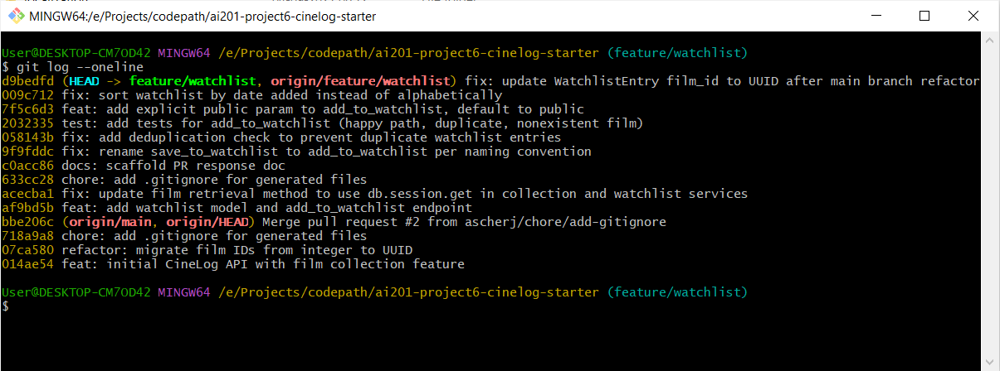

# PR Response Doc - CineLog Watchlist Feature

## Commit History

Final `git log --oneline` on `feature/watchlist`, rebased onto `main` and cleaned up via interactive rebase — 10 commits, all conventional format, no merge commits:

## AI Usage

<!-- Fill in at the end — how you used AI tools during this project -->

## Comment 1 - Rename

**What I did:** Renamed `save_to_watchlist()` to `add_to_watchlist()` in
`services/watchlist_service.py`, and updated the import and call site in
`routes/watchlist/watchlist.py` to match. Now consistent with the project's
`verb_to_noun` convention (`add_to_collection`, `remove_from_collection`).
**How I verified:** Searched the project for all references to
`save_to_watchlist` (project-wide search / find-all-references) and confirmed
only two occurrences existed - the definition and one call site — both updated.
Ran `pytest tests/ -v` afterward; all 4 existing tests still passed.

## Comment 2 - Deduplication

**What I did:** Added `AlreadyInWatchlistError` to `services/watchlist_service.py`
and a dedup check in `add_to_watchlist()` - queries for an existing
`WatchlistEntry` with the same `user_id`/`film_id` before creating a new one,
raising `AlreadyInWatchlistError` if found. Mirrors the pattern in
`add_to_collection()`. Also updated `routes/watchlist/watchlist.py`'s `add_film`
route to catch both `FilmNotFoundError` (404) and `AlreadyInWatchlistError`
(409), matching `routes/collection.py`'s error handling - previously neither
exception was caught there, so both cases would have 500'd.
**How I verified:** Ran `pytest tests/ -v` - all 4 existing tests still pass.
(No automated test for the duplicate case yet - will add one in Comment 3/test coverage work.)

## Comment 3 - Missing test

**What I did:** Created `tests/test_watchlist.py`, mirroring the fixture
structure of `test_collection.py` (`app`, `sample_user`, `sample_film`).
Added three tests: `test_add_to_watchlist_creates_entry` (happy path),
`test_add_to_watchlist_duplicate_raises` (validates the Comment 2 dedup fix),
and `test_add_to_watchlist_nonexistent_film_raises` (the test the reviewer
asked for). Went beyond the literal ask since CONTRIBUTING.md requires 3
tests minimum for any new service function, and `add_to_watchlist()` had zero
coverage before this. One adaptation from the `test_collection.py` pattern:
the fake nonexistent film_id is an integer (`999999`), not a UUID string,
since `Film.id` is still `Integer` on this branch (pre-rebase).
**How I verified:** Ran `pytest tests/test_watchlist.py -v` - all 3 pass.
Ran the full suite `pytest tests/ -v` - 7 passed, no regressions.

## Comment 4 - Default visibility

**My position:** Watchlist entries stay public by default, but users can
switch individual entries to private.
**Reasoning:** I first considered private-by-default, since a watchlist is
personal - just things someone wants to watch, not something they've
committed to. But CineLog is a community app, and I realized most people
never bother changing a default setting. If watchlists started private,
almost nobody would ever turn on sharing, even if they wouldn't mind
sharing it - so the community/recommendation angle of the app would barely
get used in practice. That's a bigger loss than I first gave it credit for.
**Tradeoff acknowledged:** Public-by-default does mean some users' movies
they merely _want_ to watch are visible to others unless they actively
choose to make an entry private. That's a real privacy cost for anyone
who doesn't realize/bother to opt out. I think that cost is acceptable
here because the entries are still opt-out (not forced permanently
public), and the community value — people recommending movies to each
other, seeing what friends want to watch — matters enough for this app
to accept that tradeoff. Implemented via an explicit `public` parameter
on `add_to_watchlist()` (default `True`), so it's a conscious default
rather than an invisible one, and callers can pass `public=False` per
entry if they want privacy.

## Comment 5 - Sort order

**My position:** Default to date-added (newest first), matching the
reviewer's preference - but I'd also want a `?sort=` option later so users
can switch to alphabetical if they want, instead of only ever getting one order.
**Reasoning:** Most people opening their watchlist want to see what they
just added, not scroll to find it alphabetically - this also matches how
`get_collection()` already sorts (`date_added.desc()`), so it's consistent
across the app.
**Engagement with reviewer's point:** I agree with the reviewer's reasoning
for the default. I considered keeping alphabetical, but couldn't find a
strong reason it would serve most users better - it mainly helps if you're
searching for a specific title, which is less common than "what did I just
add." Where I went beyond just agreeing: I think locking in one sort order
either way is a bit limiting, so a `?sort=name`/`?sort=date_added` query
parameter would be the better long-term answer. I didn't build that now
(scoped out for time), but wanted to document it as the fuller answer I'd
pursue with more time.

## Comment 6 - Rebase

**What conflicted:** Ran `git fetch origin` then `git rebase origin/main`.
Most of the 14 commits on `feature/watchlist` applied cleanly. Two real
conflicts came up:

1. `.gitignore` - both branches added one independently (`f2934ab` vs. main's
   earlier gitignore commit). Resolved by keeping both sets of entries
   (main's list plus my `claude.local.md` line).
2. `models.py` - applying the commit that changed `WatchlistEntry.public`'s
   default hit a conflict, because `CollectionEntry.film_id` and
   `WatchlistEntry.film_id` were still typed as `Integer` in my branch's
   history, while `main` had already migrated `Film.id`/`CollectionEntry.film_id`
   to UUID strings. Resolved by keeping `main`'s UUID-based `CollectionEntry`
   and updating `WatchlistEntry.film_id` to `db.String(36)` to match.
   **How I resolved it:** After the rebase completed with no more conflicts
   reported, I found that a later commit had silently reverted
   `WatchlistEntry.film_id` back to `Integer` (git applied that patch without
   flagging a conflict, even though it undid my manual fix — a known rebase
   gotcha when a later commit's context-matching is fuzzy). Caught this by
   re-reading `models.py` after the rebase finished, rather than trusting
   "no conflicts" to mean "fully correct." Fixed it again, plus updated two
   stale docstrings (`services/watchlist_service.py`, `routes/watchlist/watchlist.py`)
   still describing `film_id` as an integer, and changed the fake nonexistent
   `film_id` in `tests/test_watchlist.py` from an integer (`999999`) to a fake
   UUID string, matching `test_collection.py`'s convention.
   **How I verified no conflict remains:** Ran `git log --oneline --graph` to
   confirm a single straight line with no merge commits after `main`'s tip.
   Ran `pytest tests/ -v` - all 7 tests pass, including the updated
   nonexistent-film test with a real UUID-shaped fake ID.

## PR Description

<!-- Written at the end — feature overview, design decisions, manual testing steps -->
